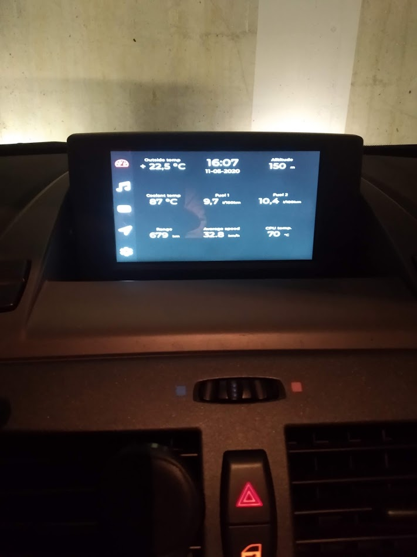
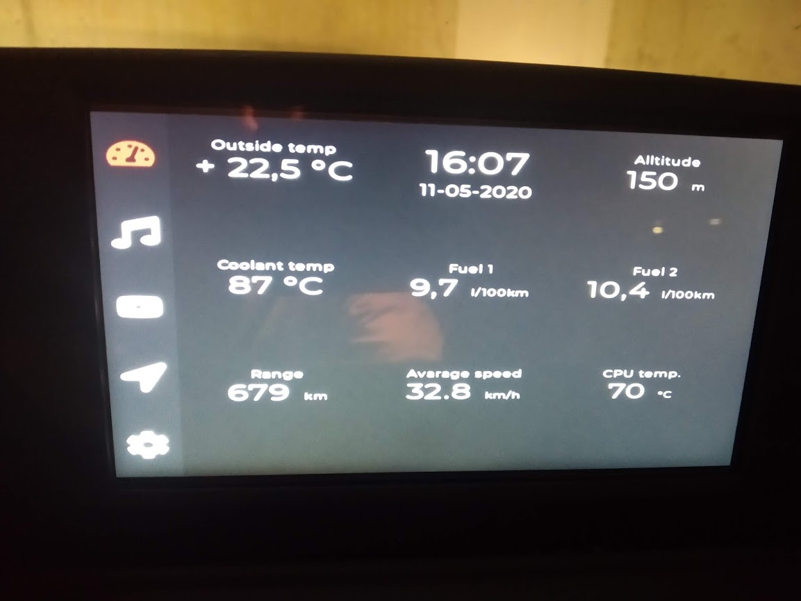
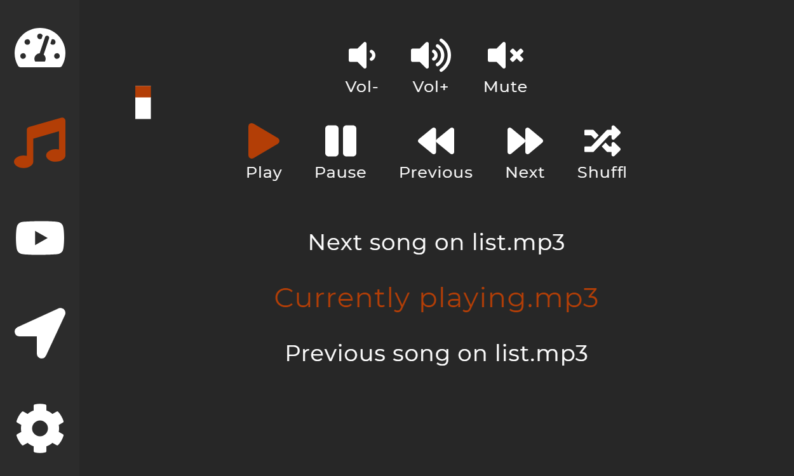
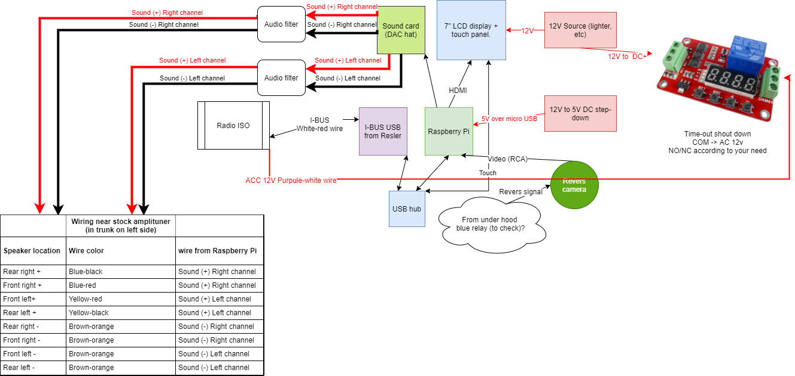

This aplication and hardware was designed to replace default/stock navigation/radio provided by BMW in my x3 e83 (2004).<br>
Not ready yet :)

### How it looks
#### Dashboard GUI



#### Music GUI


`more to come`

<h3>Hardware:</h3>
<ol>
  <li><del>Raspbery pi 3B+</del> - heart of hardware, in short Raspberry sucks, a better alternative is Rock Pi 4 Model B 1GB (cost about this same, and have a lot more features, for example can run on 12V (this will eliminate need steepdown DC converter usage, and eMMC disk can be installed))</li>
<li>Resler USB IBUS interface (I encourage you to try other solutions, cheaper ones @aliexpres :) )</li>
<li>DAC plus soundcard (raspberry pi hat), DYKB PCM5122 Raspberry pi B+ 2/3B HIFI DAC + Sound Card Digital Audio Module</li>
<li>12v step down DC converter with output set around 5,7V</li>
<li>Bluetooth dongle</li>
<li>Cables (for speakers, HDMI, USB extender 5m+, comon USB extender)</li>
<li>Few realeys (10A will do)</li>
<li>6,5 inch touchscreen with control board PCB800099-V.9.</li>
<li>Revers camera</li>
<li>GPIO Extension Expansion Board Module for Raspberry pi 3B+</li>
</ol>

#### Wiring diargam/schematics


<h3>Software:</h3>
<ol>
<li>Raspbian</li>
<li>Node.JS</li>
<li>Electron</li>
<li>more in package.json ;)</li>
</ol>

<h3>Few facts:</h3>
<ol>
<li>GUI was designed for 6,5 inch screen (800 x 480 px)</li>
<li>Image from revers camera is handled by PCB control board (when revers gear is on then revers camera is on and signal send to control board)</li>
</ol> 

<h3>Aplication can:</h3>
<ol>
  <li>Displays diffrent data from car CAN network like (temperature outside, fuel consumption, avarage speed, altitude, time and more</li>
  <li>Play mp3 from disk (USB to do?)</li>
  <li>Play YouTube</li>
  <li>Displays google map (navigation on to do list)</li>
  <li>Manage Wi-Fi connections</li>
  <li>Manage Bluetooth conections/devices</li>
  <li>Play music via ADSP (egz. music from phone)</li>
  <li>Be controlled from steering wheel controls</li>
  <li>Allows to do phone calls (to do)</li>
</ol>
  
### Usage
First install all dependencies:
```
npm install
```

Start application without debug logs, logs can be later turn on by setting: `debugMode = true`
```
npm start
```

Start application with debug logs
```
npm run debug
```

Rebuild application
```
npm run prepare
```

Build application for Raspberry pi 3B+ (linux)
```
npm run package
```

### Settings
More logs can be show by setting:
```
lessInfoFromCAN=false
```

### OS settings
#### Auto shutdown script
This Python script is monitoring PIN 33 status when it's changes it will run `sudo shutdown -h now` command and close Linux OS
Code:
```
from time import sleep
import RPi.GPIO as GPIO
import os

GPIO.setmode(GPIO.BOARD)
pin=33

GPIO.setup(pin,GPIO.IN,pull_up_down=GPIO.PUD_UP)

while(1):
        if GPIO.input(pin)==1:
                print "Shuting down - ACC power (switched) off"
                os.system("sudo shutdown -h now")
                sleep(.1)
```
To auto start script: `sudo nano /etc/rc.local`
and at the end add:
```sudo python /path_to_your_script_file/script.py &```

### Deployment
Github actions need tag to be present in order to compile release
First update version in package.json:
```
git commit -am 1.0.0
```
Tag your commit:
```
git tag 1.0.0
```
Push your changes to GitHub:
```
git push && git push --tags
```
